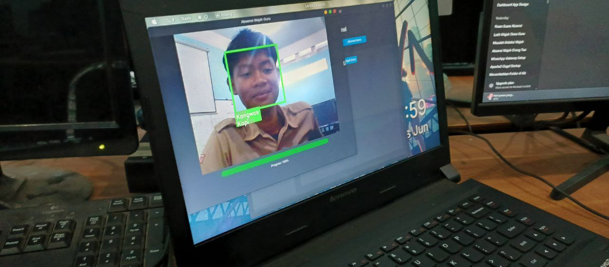

# 🛡️ FAST - Face Attendance Scan Technology

<div align="center">


**FAST (Face Attendance Scan Technology)** adalah solusi absensi desktop modern berbasis pengenalan wajah.  
Dibuat dengan Python dan CustomTkinter untuk memberikan pengalaman pengguna yang elegan dan efisien.

---

### 📱 Preview Aplikasi


</div>

---

### ⚠️ PERINGATAN PENTING: DATASET KOSONG (MULAI DARI NOL)

**Harap diperhatikan:** Saat Anda melakukan `git clone` project ini, **tidak ada data wajah (dataset) atau model yang sudah dilatih** yang disertakan. Hal ini dilakukan untuk menjaga privasi dan kebersihan repository.

Untuk menggunakan aplikasi ini, Anda **WAJIB** mengikuti langkah berikut:
1. Jalankan aplikasi menggunakan `python run.py`.
2. Masuk ke menu **Rekam Wajah** untuk mendaftarkan wajah baru (Siswa atau Guru).
3. Setelah merekam, masuk ke menu **Latih Model** untuk melakukan training secara langsung.
4. Fitur **Absensi** baru akan berfungsi setelah model berhasil dilatih.

---

### ✨ Fitur Utama

- **👤 Manajemen User Terpisah**: Mendukung data untuk **Siswa** (dengan kelas) dan **Guru** (dengan mata pelajaran).
- **🆔 Registrasi Wajah Cerdas**: Pembuatan **Face ID otomatis** yang unik untuk setiap pengguna.
- **⚡ Absensi Real-time**: Deteksi dan rekognisi wajah langsung via kamera dengan feedback instan.
- **🗄️ Database Terstruktur**: Menggunakan SQLite dengan skema 4 tabel yang ternomalisasi.
- **🎨 Antarmuka Modern**: UI bersih dan responsif menggunakan **CustomTkinter**.
- **📜 Logging Sistem**: Pencatatan aktivitas registrasi, training, dan error di terminal.

---

### 📂 Struktur Proyek Terorganisir

```text
FAST/
├── 📂 assets/              # Aset aplikasi (media, resource)
│   ├── 📂 media/           # Video latar belakang dan gambar preview
│   └── 📂 resources/       # Model Haar Cascade dan file teks pesan
├── 📂 data/                # Penyimpanan data lokal
│   ├── 📂 datasets/        # Folder gambar wajah hasil registrasi
│   ├── 📂 models/          # File model hasil training (.xml)
│   └── 📄 facesentry.db    # Database SQLite
├── 📂 src/                 # Kode sumber utama (Python)
│   ├── 📂 services/        # Logika database dan face recognition
│   ├── 📄 main.py          # Logika utama GUI
│   └── 📄 config.py        # Konfigurasi path dan parameter
├── 📂 web/                 # Landing page dan dokumentasi web
└── 📄 run.py               # Entry point untuk menjalankan aplikasi
```

---

### 🚀 Instalasi & Cara Menjalankan

Ikuti langkah-langkah di bawah ini untuk memulai:

**1. Persiapan**
- Pastikan **Python 3.10+** sudah terinstal.
- Siapkan webcam yang berfungsi dengan baik.

**2. Clone Repository**
```bash
git clone https://github.com/abyfromheaven/FAST.git
cd FAST
```

**3. Instalasi Library**
```bash
# Direkomendasikan menggunakan Virtual Environment
python -m venv venv
source venv/bin/activate  # Untuk Linux/macOS
# atau
venv\Scripts\activate     # Untuk Windows

pip install -r requirements.txt
```

**4. Jalankan Aplikasi**
```bash
python run.py
```

---

### 🛠️ Teknologi

- **Python**: Bahasa pemrograman utama.
- **OpenCV**: Pengolahan gambar & LBPH Face Recognition.
- **CustomTkinter**: Modern GUI framework.
- **SQLite3**: Database engine ringan.

---

### 🧑‍💻 Tim Pengembang

- **Muhammad Abiyan Hafidz** - Lead Developer
- **Darwin Baratha** - Web Developer
- **Rekan Aska Rastia** - Documentation
- **Muhammad Phasa** - QA & Project Management

---

### 📄 Lisensi

© 2025 **AbyFromHeaven**. Dilindungi di bawah [MIT License](LICENSE).
